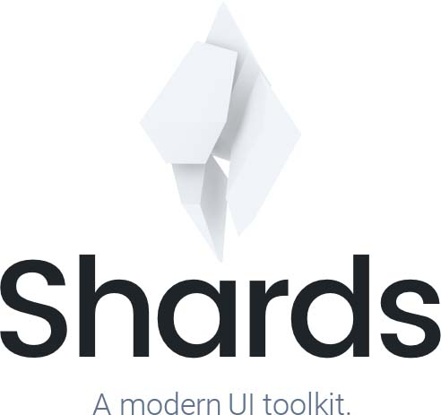

<p align="center">

</p>

<p align="center">
A modern UI kit packed with 2 custom page templates and 11 extra <br />custom components built on top of Bootstrap (4.1.3).
</p>

<br />

<p align="center">
  <a href="DELETED_URL_WITH_CREDENTIALS"en">
  <head>
    <meta charset="utf-8">
    <meta name="viewport" content="width=device-width, initial-scale=1, shrink-to-fit=no">

    <!-- CSS Dependencies -->
    <link rel="stylesheet" href="DELETED_URL_WITH_CREDENTIALS">
  </head>
  <body>
    <h1>Hello, world!</h1>

    <!-- Optional JavaScript -->
    <!-- JavaScript Dependencies: jQuery, Popper.js, Bootstrap JS, Shards JS -->
    <script src="DELETED_URL_WITH_CREDENTIALS"></script>
  </body>
</html>
```

<br />

### Usage with Bundlers

If you're using a bundler like [`webpack`](https://webpack.js.org) (with [`style-loader`](https://github.com/webpack-contrib/style-loader)/[`css-loader`](https://github.com/webpack-contrib/css-loader)) or [`parcel`](https://parceljs.org), you can [install `shards` with `npm`](#getting-started) and import it:

```javascript
// app.js
import 'bootstrap/dist/css/bootstrap.min.css';
import 'shards-ui/dist/css/shards.min.css';
// Optional JavaScript
// JavaScript Dependencies: jQuery, Popper.js, Bootstrap JS, Shards JS
// Install them with `npm` as well
import 'jquery/dist/jquery.slim.min';
import 'popper.js/dist/umd/popper.min';
import 'bootstrap/dist/js/bootstrap.min';
import 'shards-ui/dist/js/shards.min';
```

<br/>

### Built using

* [Bootstrap Datepicker by Stefan Petre and Andrew Rowls (Apache 2.0)](https://github.com/uxsolutions/bootstrap-datepicker)
* [noUiSlider by Léon Gersen (WTFPL License)](https://refreshless.com/nouislider/download/)
* [Material Icons](http://material.io/icons)
* [FontAwesome Icons](http://fontawesome.io)

<br />

### Contributing

Please read [CONTRIBUTING.md](CONTRIBUTING.md) for details on our code of conduct, and the process for submitting pull requests to us.

<br />

### Feedback

Building better products is something I'm trying to get really good at. I’d love to hear more about how you plan on using Shards and what features you consider important in similar products. If you could spare a few minutes, please fill out [this Google Form](https://docs.google.com/forms/d/e/1FAIpQLScyj8F-fyVlb-AAeM-UFXSpDgrfdC81yWm1BNF8_gVCpXN8jw/viewform?usp=sf_link) to help me better understand your current context and what I could do to improve my products.

<br />

### Acknowledgments

While building this project we used various free resources built and made
available by some wonderful people around the world. See the [ATTRIB.md](ATTRIB.md) file for details.

<br />

### Changelog

[View notable changes.](CHANGELOG.md)
